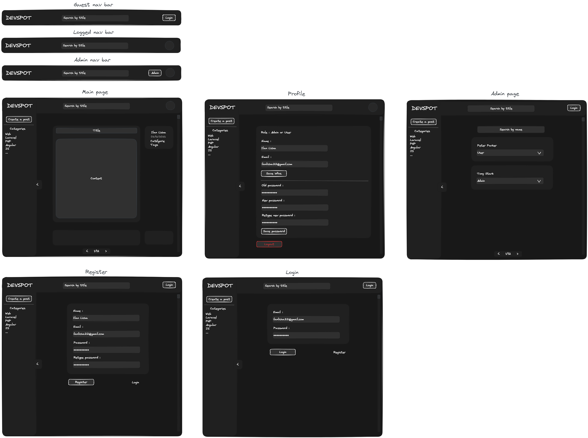

<h2 align="center">Notice d'installation</h2>
<h1 align="center">DevPost</h1>

## Récupérer le projet et l'installer
```
git clone https://github.com/Ilan22/DevPost.git
```
```
cd DevPost
composer install
```
```
php artisan key:generate
```
Copier .env.example en .env :
```
cp .env.example .env
```
Modifier la ligne 14 `DB_DATABASE` avec le nom de bdd souhaité. Puis :
```
php artisan migrate
```
```
php artisan icons:cache
```
```
php artisan serve
```

## Utilisation du blog - Prérequis :

### Créer un utilisateur admin :
Acceder a l'application puis **créer un compte**.  
Il y a deux rôles créés par défaut : `user` (id=1) et `admin` (id=2).  
A l'aide de phpMyAdmin par exemple :  
**Passer la colonne `role_id` de la ligne créée dans la table `users` à `2` afin de le rendre admin.**  
Recharger le site web. Un bouton 'admin' apparaît dans la barre de navigation du haut.

### Créer un/des tags/catégories :
Accéder à l'interface administrateur avec le bouton 'admin'.  
Créer un ou plusieurs tags/catégories à l'aide des formulaires.

## Utilisation du blog - Guide :

### Profil :
Il est possible de modifier **soit** son nom, soit son **email** ou bien son **mot de passe**.

### Créer/Modifier un article :
Tout utilisateur peut créer un article mais seul son auteur ou un admin peut le modifier/supprimer.  
Cliquer sur le bouton 'Créer un article' dans la barre de navigation de gauche.  
Un article contient : 
- Un titre de 5 caractères minimum
- Un contenu obligatoire de 5000 caractères maximum
- 0-n tags
- Une catégorie

### Visualiser un article :
Après la création d'un article vous serez redirigé vers cet article.  
Il est possible de :
- Voir son titre et son contenu
- Voir son auteur, sa date de création, sa catégorie et ses tags
- Aimer l'article, le modifier (si admin ou auteur)
- Supprimer l'article (si admin ou auteur)
- Ecrire un commentaire, le supprimer (si admin ou auteur)

### Lister les articles :
En cliquant sur le logo 'DEVPOST' vous serez redirigé vers la page principale qui liste tous les articles.  
Il est possible de les trier ainsi :
- Par nom depuis la barre de navigation du haut (le texte demandé est contenu dans le titre et pas exact)
- Par catégories ou par tag depuis la barre de navigation de gauche

Une pagination des articles sera présente si il y en a plus de 10 trouvés suite aux filtres  
Il suffit de cliquer sur la carte d'un article pour y acceder

### Interface admin :
Comme vu plus tôt il est possible de créer/supprimer des catégories et des tags.  
Mais aussi supprimer un utilisateur ou bien le passer de user à admin ou l'inverse.

## Maquette originale :
Voici la maquette avant la création du site web :


On peut voir que le résultat du site web n'est pas exactement comme la maquette.  
En effet au fur et a mesure du développement du blog, des nouvelles idées sont apparues ou bien je trouvais que l'idée de base était mauvaise et je voyais une nouvelle manière de faire.  
**Les changements :**
- Je pensais faire la visualisation des articles directement depuis la page principale et de tous les lister ainsi.  
J'ai trouvé plus pratique de lister les articles avec leur titre et de pouvoir y accéder. C'est aussi plus pratique pour les commentaires.
- Pour la page administrateur je trouvais inutile de lister tous les utilisateurs tandis qu'une selection est plus adéquate.
